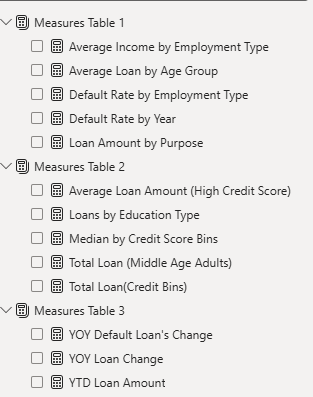
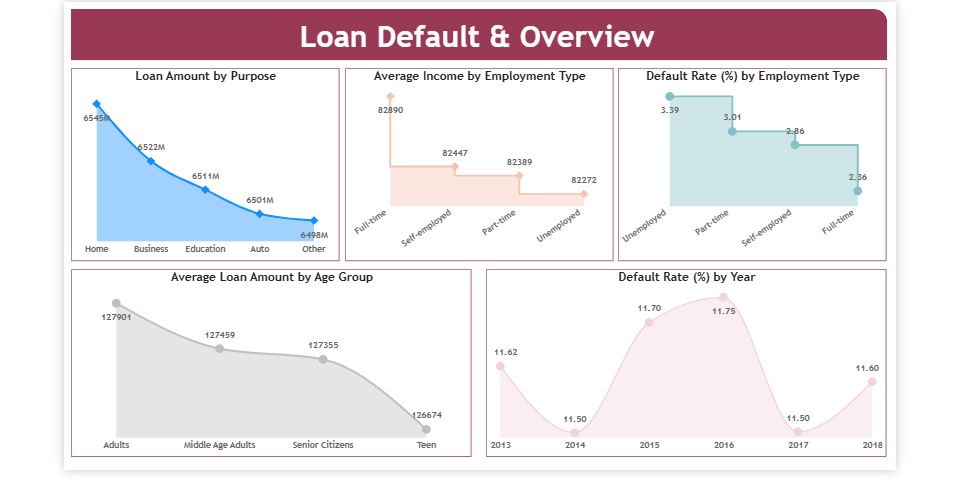
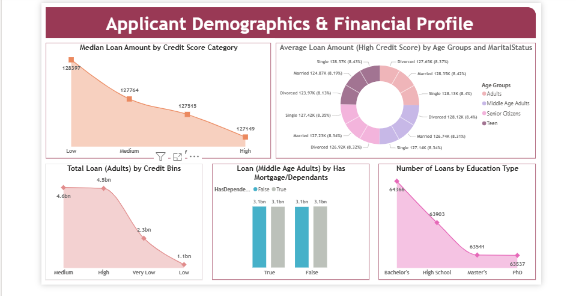
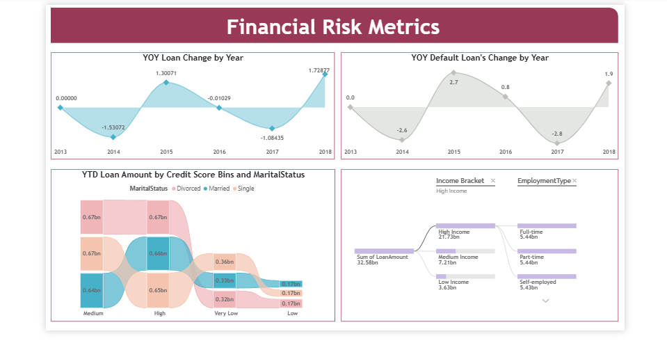

# Loan Default Report

## 📝 Project Overview
This project analyzes loan default risk patterns to uncover key drivers of borrower behaviour and financial risk. Using a dataset of over 255,000 loan records, I built an end-to-end analytics solution using Microsoft SQL Server and Power BI to support data-driven lending decisions.

The goal was to answer a core business question:
What factors influence loan default risk, and how can financial institutions reduce exposure while optimizing lending decisions.

---

## 📦 Table of Contents
- [Project Overview](#-project-overview)
- [Dataset](#-dataset)
- [Tools Used](#-tools-used)
- [Data Transformation](#-data-transformation)
- [Data Preparation](#-data-preparation)
- [Data Model & Measures](#-data-model--measures)
- [Exploratory Data Analysis](#-exploratory-data-analysis)
- [Key Insights](#-key-insights)
- [Dashboard](#-dashboard)
- [Recommendations](#-recommendations)

---

## 📂 Dataset

### Data Source:
Dataset provided through a Udemy-based structured analytics training program

### Data Description
The dataset contains detailed loan application and default information, including customer demographics, employment details, and financial attributes.

### Dataset Size
- Rows: 255,347
- Columns: 19

### Key Fields
- Loan Amount
- Income
- Default
- Credit Score
- Age Group
- Marital Status
- Credit Score Bins
- Has Mortgage
- Has Dependant

---

## 🔧 Tools Used
- Microsoft SQL Server - Data Storage, ingestion and initial exploration.
- Power BI Dataflows - Created a centralized dataflow and perpared data for reporting
- Power BI Desktop - Data modeling, calculated column, DAX measures and dashboard development.

---

## 🧹 Data Transformation
To ensure analytical accuracy and reporting effiency, the following transformations were performed:
- Removed duplicate records and cleaned inconsistencies
- Trimmed leading and trailing spaces
- Standardized data types
- Created calculated columns to enhance segmentation and analysis
- Developed DAX measures for analysis

---

## 📊 Data Preparation
Calculated columns were created in Power BI Desktop and used extensively in dashboard development. These columns enabled grouping, filtering and deeper analysis.
- **Age Groups** - Segmented customers into life stages for behavioural analysis (Teens, Adults, Middle Age Adults, Senior Citizens)
- **Credit Score Bins** - Classified customers into risk tiers.(High, Medium, Low, Very Low)
- **Income Bracket** - Grouped income levels for affordability analysis (Low Income, Medium Income, High Income) 
- **Year** - Used to actualize the exact year loan was taken to perfrom trend analysis and for time-series

These calculated columns formed the foundation for several DAX measures, dashboard visuals and insights.

---

## 🧠 Data Model & Measures

|Measure Name|Description|
|------------|-----------|
|Loan Amount by Purpose|Total loan amount grouped by loan purpose|
|Default Rate by Employment Type|Loan default comparison across job types|
|Average Loan Amount (High Credit Score)|Lending behaviour of low-risk-customers|
|Median by Credit Score Bins|Median loan amount across credit score category|
|Total Loan (Middle Age Group)|Total loan amount for middle age group|
|YOY Loan Change by year|Year-over-year change in total loan amount|
|YOY Default Loan's Change|Year-over-year change in default rate|
|YTD Loan Amount|Tear-to-date total loan amount|
|Others|Additional supporting measures used for dashboard calculations|

---

## 📈 Exploratory Data Analysis
- Most loans were taken for home-related purposes.
- Adults represent the highest loan-taking demographic
- The default rate(%) which was 11.62 in 2013 grew to 11.75 in 2016 and went down to 11.60 in 2018.
- Unemployed applicants recorded the highest default rate percentage.
- Low credit score customers tend to have higher median loan amount.
- Loan volumes increased in 2018 compared to previous years
- Year-over-year default rate increased in 2018 despite a decline in 2017

---

## 🔍 Key Insights
- Employment status is a major predictor of loan default risk
- Loan demand is highest among Adults and for home-related purposes
- Risk exposure is unevenly distributed across demographic segments.
- Credit score strongly influences loan behaviour and repayment patterns.
- Despite growth in loan volume, default risk remains relatively stable over time.
- Loan volume increased significantly in 2018, indicating portfolio expansion.
- Certain high-risk groups (e.g., unemployed and low credit score customers) require stricter lending policies.

---

## 📊 Dashboard

An interactive Power BI dashboard was developed to provide a multi-dimensional view of the dataset, including
- Overview of total loan amount, loan purposes and default rates.
- The demographics and financial profiling of applicants.
- Year-over-year trends across key risk and financial metrics.
  
### Dashboard 1 - Loan Default & Overview

### Dashboard 2 - Applicants' Demographics and Financial Profile

### Dashboard 3 - Financial Risk Metrics

---

## 💡 Recommendations
- Strengthen credit assessment for applicants with low credit scores.
- Tighten lending criteria for low-credit score + unemployed applicants.
- Increase monitoring of high-volume segments (e.g. home loans)
- Use income and credit score segmentation to refine risk-based pricing.
- Continously track YOY defaut trends to detect emerging risk patterns.
